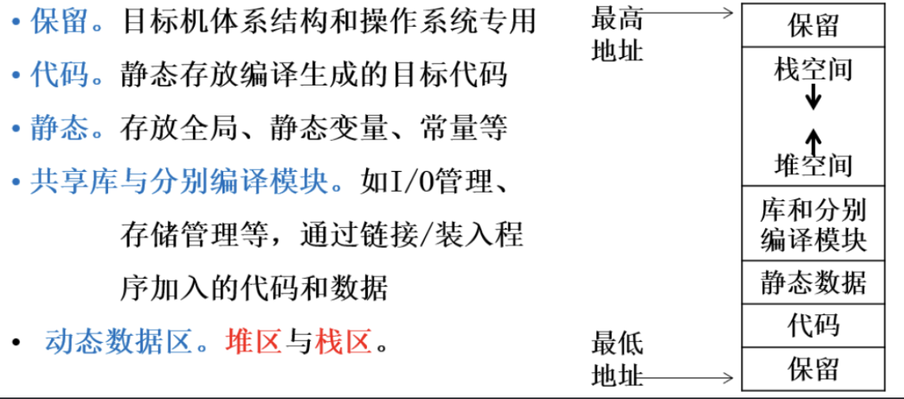

# Chapter 10 Runtime Space

## 运行时存储空间

编译程序是将源程序的**算法描述部分和数据说明部分**, 分别翻译成**机器目标代码和数据存储单元**, 最终获得目标程序.

目标程序在目标机环境中运行时, 都置身于自己的一个运行时存储空间.在基于操作系统之上运行的情况下, 目标程序将在自己的逻辑地址空间内运行并存储数据.编译程序在生成代码时, 负责明确各类对象在逻辑地址空间是如何存放的, 以及目标代码运行时, 如何使用逻辑地址空间.

在编译过程中, 源程序的对象地址分配往往是相对于运行存储空间的偏移量, 对象访问采用“基地址＋偏移量”寻址方式进行, 使得可以选择内存的任意可用区域作为目标程序运行时的存储区.这样生成的目标代码称为浮动地址代码

> **注：“基地址”是指运行存储空间之首址.**

**重点：符号表的内容、组织, 过程调用实现, **

**静态存储分配、动态存储分配的基本方法.**

**难点：参数传递, 过程说明语句代码结构, **

​ **过程调用语句的代码结构, **

​ **过程调用语句的语法制导定义, **

​ **栈式存储分配.

编译程序生成的代码大小通常是固定的, 一般存放在专用的区域, 即代码区；  
目标程序运行过程中, 需要创建和访问的数据对象存放在数据区.

数据空间分配是将**源程序数据对象名与给定的数据存储空间地址建立映射关系**.

数据对象名与数据存储地址可能是一对多的关系, 因为在源程序中说明的一个数据对象, 在运行时可能对应不同的存储地址, 如递归程序中的局部变量.

## 静态存储分配

静态存储管理是一种最简单的存储管理.

**当在编译阶段能够确定源程序中各个数据实体的存储空间大小**时, 就可以采用静态存储管理.一般而言, 适于静态管理的语言必须满足下面的条件：

1. 数组的上下界必须是常数；
2. 过程调用不允许递归；
3. 不允许用户动态地建立数据实体

对于静态存储分配, 数据空间仅需要有静态数据区即可.

在源程序翻译时, 对于所有数据对象, 其分配的存储地址都是相对于静态数据区的偏移量.

这个偏移量就是登记在符号表中数据对象的地址( .place)属性值.

在目标程序运行时, 访问数据对象的绝对地址是：

**绝对地址＝静态数据区首址+偏移量.**

## 动态存储分配

如果源语言允许递归调用、可变数组和允许运行期间自由申请与释放空间, 那么其需占用的存储空间在编译阶段无法确定, 这样数据对象就需要采用动态存储分配的策略.

所谓动态存储分配是指在运行期间, 动态进行存储地址分配.

•**基于控制栈的原理, 存储空间被组织成栈, 活动记录的推入和弹出分别对应于活动的开始和结束.**

•**与静态分配不同, 在每次活动中把局部名字和新的存储单元绑定, 在活动结束时, 活动记录从栈中弹出, 因此局部名字的存储空间也随之消失.**

### 栈式动态存储分配

由于过程允许递归, 在某一时刻一个过程A 很可能已被自己调用了若干次, 但只有最近一次正处于执行状态, 而其余各次则处于等待返回被中断的那次调用的状态.

这样, 属于每次调用相应的数据区中的内容就必须保存起来, 以便于调用返回时继续使用

对于这种语言来说, 其存储分配策略必须采用栈式存储管理, 即引入一个运行栈, 让过程的每一次执行和过程的调用记录相对应, 每调用一次过程, 就把该过程的相应调用记录推入栈中, 过程执行结束时再把栈顶的调用记录从找中弹出.

> 在运行期间以子程序数据区为基本单位, 在数据空间栈中进行动态地址分配.
> 
> 当调用子程序时, 在数据空间栈顶, 给子程序分配所需的子程序数据区；
> 
> 当子程序返回时, 从数据空间栈顶, 收回分配给子程序所占用存储区.
> 
> 当子程序被递归调用时, 同一个子程序可能在数据空间中同时拥有多个子程序数据区, 每个数据区对应于同一个子程序的一次执行过程.

### 堆式动态存储分配

某些程序设计语言(如C 和PASCAL等）允许程序在运行时, 为其中的一些变量动态地申请和释放所需的存储空间, 并且申请和释放这两类操作可以在任何时间、以任意的顺序来进行, 这就需要一种更为灵活和更加有效的动态分配策略, 即堆式存储分配来完成上述工作.

堆式分配的基本思想是：**为正运行的程序划出一适当大的存储区域, 称之为堆（Heap) ; 每当该程序提出申请时,  就按某种分配原则在堆的自由区（可占用区） 中, 找出一块能满足其需求的存储空间分配给它, 对于释放操作, 则是将程序不再占用的存储空间归还给堆的自由区.**  

可能遇到的各种情况与操作系统给进程分配存储空间时遇到的极其相似, 如同样会出现“碎片”现象等, 其根本差异就在于分配的层次和分配对象的粒度.

## 活动记录

1.活动记录本质是什么？

> 活动记录本质上是每次为函数调用时分配的一大块内存.一个函数的活动记录只由在函数被调用时才会创建, 并且当函数返回时就会被销毁.

2.活动记录是如何存在的？

> 活动记录被组织在栈中, 栈可以是物理上的实体也可以是逻辑上的概念.在数据结构中的栈是一个逻辑上的概念, 而芯片中也可以根据这个概念来设计一部分电路, 这部分能够模拟栈操作的电路就是物理意义上的栈了.  
> 主函数的活动记录位于栈底, 当一个函数调用另外一个函数时, 被调用函数的活动记录就会被压入栈.或当记录所在的栈满足数据结构中的栈的特性：FILO(first in last out).这个限制使得当主调函数和被调函数中出现了同名函数时, 在执行被调函数时主调函数的变量对被调函数来说是不可见的.  
> 特别提醒：大部分计算机为活动记录栈分配内存地址都是从高到低！

3.活动记录是如何进行入栈出栈的？

> 由于活动记录是位于一个栈中的, 所以要近栈就需要知道栈结束处的位置, 当出栈时就需要知道当前活动记录之前的一个活动记录的结束点.  
> 所以编译器和硬件都会维护两个很重要的值：栈指针, 帧指针.  
> 栈指针：始终指向战结束处（注意不是栈底！）的地址, 如果有新的活动记录入栈, 那里就是新活动记录的起始地址所在.  
> 帧指针：保存着先前那个活动记录的结束处的地址, 在当前函数返回后, 栈指针就会指向那里.  
> 栈指针和帧指针就是用来界定活动记录的, 并操作活动记录

