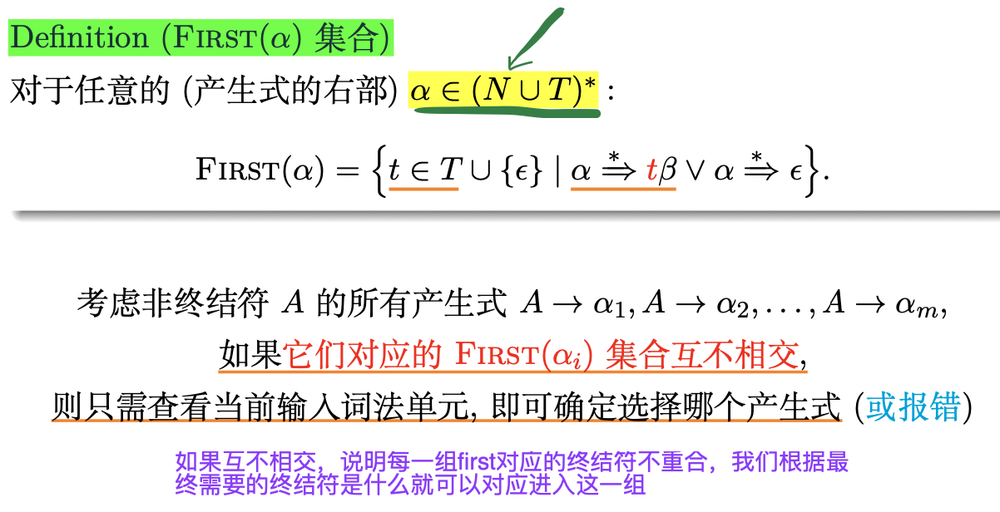
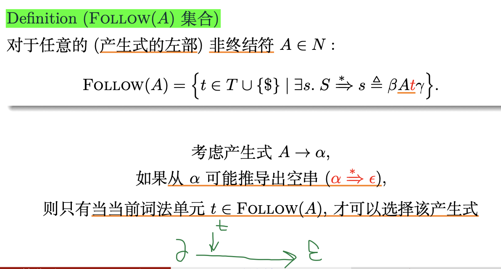

# Chapter 5 递归下降的 LL(1) 语法分析器

## 引入

1. 只考虑无二义性的文法, 每个句子对应唯一的一棵语法分析树
2. 自顶向下的、递归下降的、基于预测分析表的、适用于LL(1) 文法的 LL(1) 语法分析器

## 设计规则

- 根节点是文法的起始符号 S
- 每个中间节点表示对某个非终结符应用某个产生式进行推导 (Q : 选择哪个非终结符, 以及选择哪个产生式)
- 叶节点是词法单元流 w$ ，仅包含终结符号与特殊的文件结束符 $ (EOF)

1. 在推导的每一步, LL(1) 总是选择最左边的非终结符进行展开
2. LL(1): 从左向右读入词法单元

## 使用预测分析表确定产生式

Definition (预测分析表)

>指明了每个非终结符在面对不同的词法单元或文件结束符时, 该选择哪个产生式 (按编号进行索引) 或者报错 (空单元格)

Definition (LL(1) 文法)

如果文法 G 的预测分析表是无冲突的, 则 G 是 LL(1) 文法

无冲突: 每个单元格里只有一个产生式 (编号)

对于当前选择的非终结符, 仅根据输入中当前的词法单元 (LL(1)) 即可确定需要使用哪条产生式

## First Set && Follow Set

- First(α) 是可从 α 推导得到的句型的首终结符号的集合
- Follow(A) 是可能在某些句型中紧跟在 A 右边的终结符的集合

