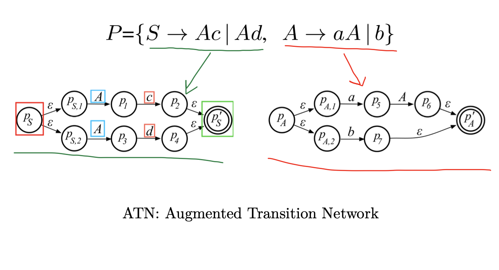

# Chapter 6 Adaptive LL(∗) 语法分析算法

LL(1) 语法分析算法的处理能力有限 (左递归文法, 带左公因子的文法)

ANTLR 4 采用的 Adaptive LL(∗) 语法分析算法功能强大

1. ANTLR 4 自动将类似 expr 的左递归规则重写成非左递归形式 
2. ANTLR 4 提供优秀的错误报告功能和复杂的错误恢复机制
3. ANTLR 4 几乎能处理任何文法 (二义性文法 间接左递归)

采取动态分析, 而非静态分析: Adaptive LL(∗)

