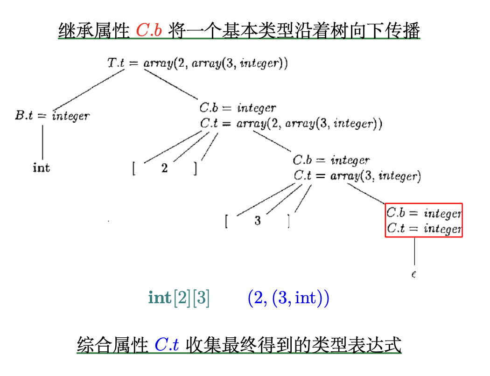
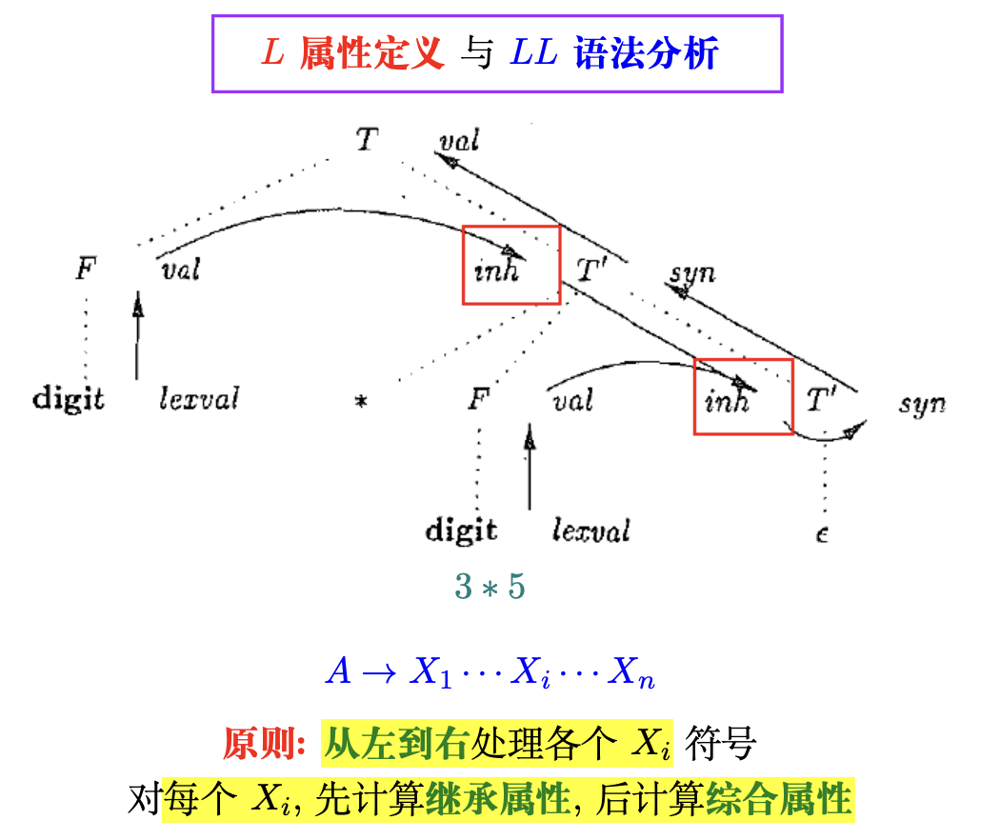
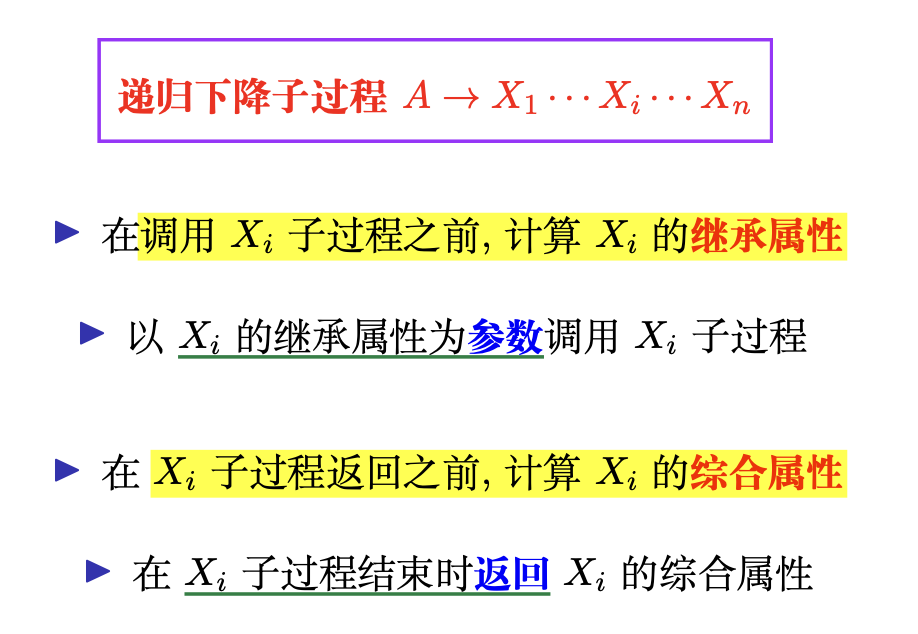

# Chapter 8 Semantics Analysis

>Review
>1. Regular Expression (词法分析) 
>2. Context-Free Grammar (语法分析)

## Attribute Grammar

属性文法 (Attribute Grammar): 为上下文无关文法赋予语义

- 按照从左到右的深度优先顺序遍历语法分析树 
- 关键: 在合适的时机执行合适的动作，计算相应的属性值
- 在语法分析过程中实现属性文法

__在语法分析过程中实现属性文法__

1. 语义动作嵌入的位置决定了何时执行该动作
2. 基本思想: 一个动作在它 __左边__ 的所有文法符号都处理过之后立刻执行

## 继承属性文法

L.inh 将声明的类型沿着标识符列表向下传递

## 综合属性文法

Definition (综合属性 (Synthesized Attribute))

>节点 N 上的综合属性只能通过 N 的子节点或 N 本身的属性来定义

## SDD

Definition (语法制导定义 (Syntax-Directed Definition; SDD)) 

>SDD 是一个上下文无关文法和属性及规则的结合

- 每个文法符号都可以关联多个属性
- 每个产生式都可以关联一组规则
- SDD 唯一确定了语法分析树上每个非终结符节点的属性值 (SDD 没有规定以什么方式、什么顺序计算这些属性值)

注释 (annotated) 语法分析树: 显示了各个属性值的语法分析树

## Depending Graph

依赖图 用于确定一棵给定的语法分析树中各个属性实例之间的依赖关系

- S 属性定义的依赖图刻画了属性实例之间自底向上的信息流动, 此类属性值的计算可以在自顶向下的 LL 语法分析过程中实现
- 在 LL 语法分析器中, 递归下降函数 A 返回 时, 计算相应节点 A 的综合属性值

## Inherited Attribute

Definition (继承属性 (Inherited Attribute))

>节点 N 上的继承属性只能通过N 的父节点、N 本身和 N 的兄弟节 点上的属性来定义

继承信息流向: 先从左向右、从上到下传递信息

## L-Attributed Definition

Definition (L 属性定义 (L-Attributed Definition)) 如果一个 SDD 的每个属性

1. 要么是综合属性,
2. 要么是继承属性, 但是它的规则满足如下限制:对于产生式 A → X1X2 . . . Xn 及其对应规则定义的继承属性 Xi.a, 则这个规则只能使用
    - (a) 和产生式头 A关联的继承属性;
    - (b) 位于Xi 左边的文法符号实例 X1、X2、. . . 、Xi−1 相关的继承属性或综合属性;
    - (c) 和这个 Xi 的实例本身相关的继承属性或综合属性, 但是在由这个Xi 的全部属性组成的依赖图中不存在环。 则它是 L 属性定义

## 逆波兰表达式

Definition (后缀表示 (Postfix Notation))

1. 如果 E 是一个 变量或常量, 则 E 的后缀表示是 E 本身;
2. 如果 E 是形如 E1 op E2 的表达式, 则 E 的后缀表示是 E1′ E2′ op, 这里 E1′ 和 E2′ 分别是 E1 与 E2 的后缀表达式;
3. 如果 E 是形如 (E1) 的表达式, 则 E 的后缀表示是 E1 的后缀表示

## SDT

Definition (语法制导的翻译方案 (Syntax-Directed Translation Scheme; SDT))

>SDT 是在其产生式体中嵌入语义动作的上下文无关文法

后缀翻译方案: 所有动作都在产生式的最后

